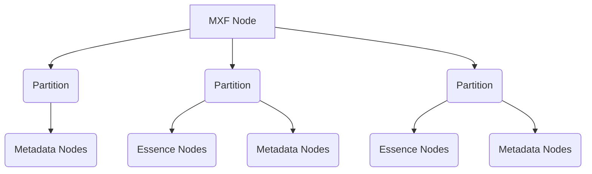
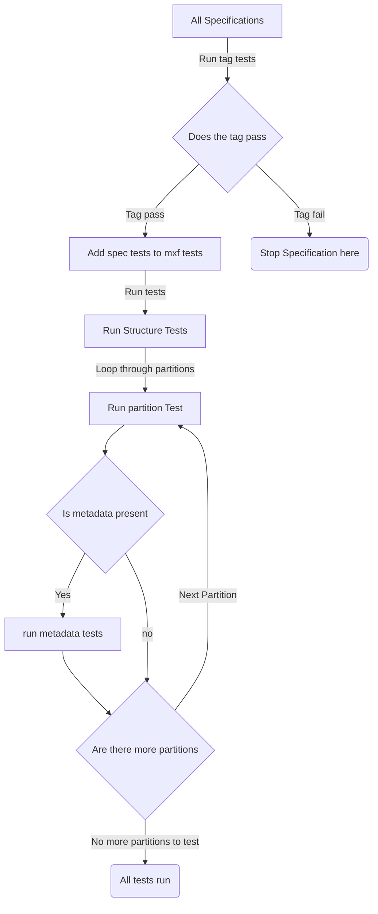

# MXF Test

MRX Unit Test is a library for testing MXF [(Material Exchange Format)][MXF] and MRX [(Metarex.media)][MRX] files.

This library provides the api for designing your own tests.
To see these tests in action check out the [MXF test repo][mrxTool], the [examples](./example/) folder,
or the [replit demo playground][demo].

All tests generate an easy to understand report detailing
what was checked, the specification it was testing to and the results.

## Contents

- [Introduction](#introduction)
- [The Report](#the-report)
- [Writing Tests to Specifications](#writing-tests-to-specification)
  - [Traversing the MXF file](#traversing-the-mxf-file)
  - [Building Custom Tests](#building-custom-tests)
    - [Data Validation Tests (Node Tests)](#data-validation-tests)
    - [Technical Tests](#technical-tests)
      - [Structural Tests](#structural-tests)
      - [File Metadata Tests](#file-metadata-tests)
    - [Specification Tags](#specification-tags)
  - [Data Sniffing](#data-sniffing)
    - [Data identifiers](#data-identifiers)
    - [Data sniffers](#data-sniffers)
- [Things to add](#things-to-add)  

## Introduction

This library is designed to allow you to quickly write easy to understand
MXF tests.

This library provides the tools for:

- Generating a test report in a simple format
- Writing your own tests to specification
- Writing conditional specifications
- An API for quickly searching MXF files

## The Report

The report details the tests that were run, the specification the tests were run
against and if they passed. In the event of test failures an extra message is given,
describing the change from the expected behaviour / result.

All Reports follow the same structure, no matter how many tests and
specifications were run when generating it.

The test report is as a yaml file and the first field is the
`testpass` field so you can tell if the mxf passed the tests at a glance.

The report contains the following fields and subfields:

- `testpass` - Has the report passed?
- `skippedTests` - An array of any tests that were not run, it has the sub fields:
  - `testkey` - The key the test was looking for to run
  - `desc` - A brief description of the skipped test
- `tests` - An array of the batch of tests that were run in the report, it has the following sub fields.
  - `header` - Header description for that batch of tests
  - `tests` - The tests that were run. These have the following fields:
    - `message` - The message of what the test is testing. It always starts with the specification being covered.
    - `checks` - An array of the assertions the test run and if they passed or failed. If it fails an
    additional `errorMessage` field is also given.
    - `pass` - Did all the tests pass?
    - `passcount` - The count of passed tests
    - `failcount` - The count of failed tests

An example report is given below

```yaml
testpass: true
tests:
    - header: testing mxf file structure
      tests:
        - message: |
            RDD47:2018,5.4,shall,3: Checking that the generic partition positions match the expected positions at the end of the file
          checks:
            - pass: true
            - pass: true
            - pass: true
            - pass: true
        - message: |
            ST377-1:2019,7.1,Table5,7: Checking the previous partition pointer is the correct byte position for the header partition at byte offset 0
          checks:
            - pass: true
      pass: true
      passcount: 5
      failcount: 0
skippedTests:
    - testkey: generickey
      desc: a skipped partition test
```

## Writing Tests to Specification

The MXF test API is designed so that you can read a MXF specification
and type it straight to go. Reducing the need to handle the mxf file
and just focus on testing the segments relevant to your specification.

The MXF file structure is broken down into a easily navigable tree,
so you can write a test and assign in to the sections of the MXF file it applies to.
Therefore you can skip the finding and validating parts of the MXF file that may be relevant. e.g. This test only applies to groups with a Universal Label of `060e2b34.02530105.0e090502.00000000`

The MXF tree is detailed [here](#traversing-the-mxf-file)
and is important for understanding how the tests work.
Once you have read how to traverse the MXF file,
a complete demo of writing tests is provided [here.](#Building Custom Tests)

### Traversing the MXF file

The MXF file is broken down into an [abstract syntax tree][AST],
so you can navigate and test the areas of the file that matter to you.
Not interested in index tables? Then don't worry you don't need to think abut them.

The abstract syntax tree of an MXF file has three types of Nodes:

1. The MXF Node - this represents the whole MXF file
and has children partitions of type Partition Node.
2. Partition Node - these nodes represent a partition and have 3 types of children,
Essence, Metadata and Index table. All of which are of type Node.
3. Node - these represent any other type of data in an MXF file, and have children
of type node. These are recursive and can have several nested layers of
node children.

The following diagram gives a visualisation of the AST layout:



When designing the MXF tests, each test needs to target one of these specific node types.
Where each node has these common uses:

- The MXF Node is used for testing the overall structure of the file.
- Partition Nodes are for checking the essence, the partition properties or its metadata.
- Node is used checking that groups within the header metadata.

This is not the limit of the node uses in tests, just a guide for test design
and where to start.

The tests are processed and run in the following order:



### Building Custom Tests

This section will walk you through the complete process
of writing MXF tests using the mxftest API, starting from
reading a specification document right
up to integrating it into your test environment.

With all specifications `shall` and `shall not` are given as keywords
for strict specification requirements. These are the key words we shall be using to define
the tests in this demo.

This section has the following contents:

- [Data Validation Tests (Node Tests)](#data-validation-tests)
- [Technical Tests](#technical-tests)
  - [Structural Tests](#structural-tests)
  - [File Metadata Tests](#file-metadata-tests)
- [Specification Tags](#specification-tags)

When writing the code from this demo,
make sure you have the following imports.

```go
import (
  "io"
  "github.com/metarex-media/mrx-tool/mrxUnitTest"
  mxf2go "github.com/metarex-media/mxf-to-go"
  . "github.com/onsi/gomega"
)
```

Which can be imported with

```cmd
go get github.com/metarex-media/mrx-tool/mrxUnitTest
go get github.com/metarex-media/mxf-to-go
go get github.com/onsi/gomega
```

A full interactive playground of these demos is available [here][demo],
feel free to play around with it to some more practice writing and
understanding tests.

#### Data Validation Tests

The contents are the most important bit of an MXF file, so this is where
we begin our testing journey. The vast majority of MXF tests written
will be utilising this test format, as the data has much more variety than
the file structure itself.
In the examples we are test to the [gps.mxf example file][gpsf], this
contains data of the Metarex type [MRX.123.456.789.gps][gps].

For simplicity we shall be using made up documentation
to describe data for this demo.
These docs have the following requirement
`All data contained in this file shall satisfy the schema of MRX.123.456.789.gps`

This means every time data is encountered in the MRX file, it has to be

1. A json file, because MRX.123.456.789.gps has a content type `"application/json"`
2. The json files pass the gps [schema][gpss]. They are not just any old json

To check the data we set up [sniff tests](#data-sniffing), these are used for
confirming the data type (in this case are they json), and running any further checks
once the data is confirmed (does the data satisfy the schema for this demo).
We can use the `mxftest/jsonhandle` library for running these tests,
which can be set up with the following code, when you set up the test specification.

```go

//go:embed testdata/gpsSchema.json
var gpsSchema []byte

// GPSSpecifications returns all the specifications
// associated with the demo MRX.123.456.789.GPS namespace
func GPSSpecifications(sc mxftest.SniffContext) mxftest.Specifications {

  // Initialising the schmea check function
  // with the sniff key GPSSchema
  schemaSniff, _ := jsonhandle.SchemaCheck(sc, gpsSchema, "GPSSchema")

  return *mxftest.NewSpecification(
    // Assign a sniff test to check files are json and valid gps data
    mxftest.WithSniffTest(mxftest.SniffTest{
      // The function to check data is json
      DataID: jsonhandle.DataIdentifier, 
      // The schema function as part of ths sniff test
      Sniffs: []mxftest.Sniffer{schemaSniff}}),
      // Assign the rest of the tests below
      ...


  )

}
```

Now we have sniffed the data, we can write the tests to
check the results of the sniff tests. We start by writing a partition test function
(partitions contain the data), they have a structure of:

```go
func testGenericPartition(doc io.ReadSeeker, header *PartitionNode) func(t Test) {
  return func(t Test) {
  }
}
```

To validate the essence of the partition, we check that there are only gps
files present. We do this by utilising the partition search function to look for non gps files in the
partition, where we are searching using the sniffing that we instansiated earlier.
This is done with the search phrase `select * from essence where sniff:GPSSchema <> pass`, which is
select all nodes, where the data did not pass the GPS json schema.
Now we have found the contents of the partition we need to test against them.

The test is constructed with the `t.Test()` function, which describes; the test being run,
a specification field and a series of assertions that the tests run.

The assertions are the comparisons we make when testing and for this library, they are **required** to be
[gomega assertions][gomega], otherwise the tests will panic and fail :( .

When writing the assertions we use the following phrasing to help build the tests:

- We expect `t.Expect(gpsSearchErr)` that there shall be no error `Shall(BeNil())` for finding the gps data - `t.Expect(gpsSearchErr).Shall(BeNil())`
- We expect `t.Expect(len(nongps))` that there shall be no non gps metadata in the essence `Shall(Equal(0)` - `t.Expect(len(nongps)).Shall(Equal(0))`
- We expect `t.Expect(len(header.Essence))` that essence shall be in the generic partition `ShallNot(Equal(0))` - `t.Expect(len(header.Essence)).ShallNot(Equal(0))`

Now we have all the ingredients we can put them together into one test function.

```go
func testBodyPartitionForGPS(_ io.ReadSeeker, header *mxftest.PartitionNode) func(t mxftest.Test) {
  return func(t mxftest.Test) {

    // check all the files are ttml
    nongps, gpsSearchErr := header.Search("select * from essence where sniff:GPSSchema <> pass")

    t.Test("checking that the partition only contains gps json files", mxftest.NewSpecificationDetails("DemoSpec", "X.X", "shall", 1),
      t.Expect(gpsSearchErr).Shall(BeNil()),
      t.Expect(len(nongps)).Shall(Equal(0), "Non GPS files found in the partition"),
      t.Expect(len(header.Essence)).ShallNot(Equal(0), "no essence found in the generic partition"),
    )
  }
}
```

Which we can integrate into the test specification
with the following code:

```go
mxftest.WithPartitionTests(
  mxftest.PartitionTest{PartitionType: mxftest.Body, Test: testBodyPartitionForGPS},
),
```

Where the PartitionType is the partition type of the node being tested, in this case
it's `mxftest.Body`, which is the body partition where data is kept.

Congratulations you have, written your first MXF test,
you have:

- Written a test to specification requirement
- Set up a sniff function to comb your data
- Checked those sniff results in a test
- Utilised the partition  search function
- Added the test to a specification

#### Technical Tests

These demos are for walking through testing the structure of an MXF file,
because some specification require certain properties to be present in the
file metadata, or there to be certain structural requirements.
These demos will take you through both types of tests.

- [Structural tests](#structural-tests)
- [File metadata tests](#file-metadata-tests)

##### Structural Tests

This demo will take you through testing the structural elements of
an MXF file. For this demo we will be
using [R133][r133], a European Broadcasting Union specification on using
Subtitle files in MXF, it is a free specification and is **not** hidden behind a paywall.

On page 10 of R133 the following requirements are given
`"All Generic Stream Partitions that contain subtitles shall be placed at the end of the MXF file"`

This means all the generic partition segments in the mxf file, must come after the header
and body partitions, and before the footer and Random Index Pack (where present).

The structure test which takes the form of:

```go
func checkStructure(doc io.ReadSeeker, mxf *MXFNode) func(t Test) {
  return func(t Test) {

  }
}
```

Note how it takes the MXF node as the input, so that
the whole structure of the MXF file can be checked.

For this test we need to find every generic partition, then the footer and random index pack.
We find these using the mxfNode search function, searching for the partitions based on
their types e.g.
`"select * from partitions where type = body"`.
We can then calculate the expected positions of the generic partitions, where the
partition positions are found with `(end partition - generic partition count) + generic partition position`.
The end partition is the count of the partitions in the file minus
the footer and random index packs positions, if they are present.

The test is constructed with the `t.Test()` function, which describes; the test being run,
a specification field and a series of assertions that the tests run.

The assertions are the comparisons we make when testing and for this library, they are **required** to be
[gomega assertions][gomega], otherwise the tests will panic and fail :( .

When writing the assertions we use the following phrasing to help build the tests:

- We expect `t.Expect(gpErr)` that there shall be no error `Shall(BeNil())` fot the finding the generic partitions - `t.Expect(gpErr).Shall(BeNil())`
- We expect `t.Expect(footErr)` that there shall be no error `Shall(BeNil())` fot the finding the footer partition - `t.Expect(footErr).Shall(BeNil())`
- We expect `t.Expect(ripErr)` that there shall be no error `Shall(BeNil())` fot the finding the random index pack - `t.Expect(ripErr).Shall(BeNil())`
- We expect `t.Expect(expectedParts)` the expected generic partitions shall match the actual positions `Shall(Equal(GenericCountPositions))` - `t.Expect(expectedParts).Shall(Equal(GenericCountPositions))`

The completed code for this test is given below.

```go
func checkStructure(doc io.ReadSeeker, mxf *MXFNode) func(t Test) {
  return func(t Test) {

    // find the generic paritions
    genericParts, gpErr := mxf.Search("select * from partitions where type = " + GenericStreamPartition)
    // find the generic partitions positions
    GenericCountPositions := make([]int, len(genericParts))
    for i, gcp := range genericParts {
      GenericCountPositions[i] = gcp.PartitionPos
    }

    // is there a footer partition?
    endPos := len(mxf.Partitions)
    footerParts, footErr := mxf.Search("select * from partitions where type = " + FooterPartition)
    if len(footerParts) != 0 {
      endPos--
    }

    // is there a Random Index Partition
    ripParts, ripErr := mxf.Search("select * from partitions where type = " + RIPPartition)
    if len(ripParts) != 0 {
      endPos--
    }

    // calculate the expected partitions
    expectedParts := make([]int, len(GenericCountPositions))
    for j := range expectedParts {
      expectedParts[j] = endPos - len(expectedParts) + j
    }

    // run the test comparing the positions
    t.Test("Checking that the generic partition positions match the expected positions at the end of the file", NewSpec("EBUR133:2012", "5.1", "shall", 3),
      t.Expect(gpErr).Shall(BeNil()),
      t.Expect(footErr).Shall(BeNil()),
      t.Expect(ripErr).Shall(BeNil()),
      t.Expect(expectedParts).Shall(Equal(GenericCountPositions)),
    )
  }
}
```

This is then integrated into the test specification with the following code:

```go
mxftest.WithStructureTests(checkStructure)
```

Congratulations you have, written your first MXF structure test,
you have:

- Written a test to specification requirement
- Utilised the MXF Node search function
- Added the test to a specification

#### File Metadata tests

This sections will take you through writing tests for checking the file
metadata. We will be using the [RDD 47][rdd47] as this describes
new file metadata that is required. This has two statements
that we will be testing to in Section 9.2 and 9.3 of RDD 47.

1. `The File Descriptor sets are those structural metadata sets in the Header Metadata that describe the essence
and metadata elements defined in this document. The ISXD Data Essence Descriptor shall be a sub-class of
the Generic Data Essence Descriptor defined in SMPTE ST 377-1. File Descriptor sets shall be present in the
Header Metadata for each Essence Element`
2. `The DataEssenceCoding item shall be present in the ISXD Data Essence Descriptor`

These statements boil down to:

1. The ISXD Data Essence Descriptor is in the file metadata
2. The ISXD Data Essence Descriptor has the field `DataEssenceCoding`,
with the set value of `060E2B34.04010105.0E090606.00000000`.

To test for these conditions we need a node test,
which takes the form of:

```go
func testISXDDescriptor(doc io.ReadSeeker, isxdDesc *mxftest.Node, primer map[string]string) func(t mxftest.Test) {
  return func(t Test) {
  }
}
```

First we check if the ISXD Data Essence Descriptor exists, if the ISXD node passed to the function
is nil then it doesn't exist and the test fails.
Then if it does exist we can decode it with the`mxftest.DecodeGroupNode` function and check the
fields it contains, we can look for the`DataEssenceCoding` field and check if the value matches
`060E2B34.04010105.0E090606.00000000`.

The test is constructed with the `t.Test()` function, which describes; the test being run,
a specification field and a series of assertions that the tests run.

The assertions are the comparisons we make when testing and for this library, they are **required** to be
[gomega assertions][gomega], otherwise the tests will panic and fail :( .

When writing the assertions we use the following phrasing to help build the tests.
For the first test we use:

- We expect `t.Expect(isxdDesc)` that the ISXD descriptor shall exist `ShallNot(BeNil())` - `t.Expect(isxdDesc).ShallNot(BeNil())`

Then once we have validated the ISXD descriptor exists we use:

- We expect `t.Expect(err)` that there shall be no error decoding the descriptor `Shall(BeNil())` - `t.Expect(err).Shall(BeNil())`
- We expect `t.Expect(isxdDecode["DataEssenceCoding"])` that the descriptor field of DataEssenceCoding shall equal 060E2B34.04010105.0E090606.00000000 `Shall(Equal(mxf2go.TAUID{...}` - `t.Expect(isxdDecode["DataEssenceCoding"]).Shall(Equal(mxf2go.TAUID{...})))`

Now we have all the ingredients we can put them together into one test function.

```go
func testISXDDescriptor(_ io.ReadSeeker, header *mxftest.PartitionNode) func(t mxftest.Test) {
  return func(t mxftest.Test) {

    // rdd-47:2009/11.5.3/shall/4
    t.Test("Checking that the ISXD descriptor is present in the header metadata", mxftest.NewSpecificationDetails(ISXDDoc, "9.2", "shall", 1),
      t.Expect(isxdDesc).ShallNot(BeNil()),
    )

    if isxdDesc != nil {
      // decode the group
      isxdDecode, err := mxftest.DecodeGroupNode(doc, isxdDesc, primer)

      t.Test("Checking that the data essence coding field is present in the ISXD descriptor", mxftest.NewSpecificationDetails(ISXDDoc, "9.3", "shall", 1),
        t.Expect(err).Shall(BeNil()),
        t.Expect(isxdDecode["DataEssenceCoding"]).Shall(Equal(mxf2go.TAUID{
          Data1: 101591860,
          Data2: 1025,
          Data3: 261,
          Data4: mxf2go.TUInt8Array8{14, 9, 6, 6, 0, 0, 0, 0},
        })))
    }
  }
}
```

The `mxf2go.TAUID{...}` value translates to `060E2B34.04010105.0E090606.00000000`and
is used because the DataEssenceCoding is declared as a AUID in the SMPTE registers.

The test is integrated into the test specification with the following code:

```go
mxftest.WithNodeTests(
  mxftest.NodeTest{UL: mxf2go.GISXDUL[13:], Test: testISXDDescriptor},
)
```

Where the UL is the ul of the node being tested, in this case
it's `060E2B34.02530105.0E090502.00000000`, which we found the using
the mxf2go library.

Congratulations you have, written your first MXF node test,
you have:

- Decoded a node
- Constructed a node test
- Added it to a specification

#### Specification Tags

Tags are test functions, but for identifying if the MXF file to be tested is an
intended target of the specification tests or not. Tags are run before the tests,
if the tags fail then those specification tests do not run on the mxf.
E.g. The ISXD tags do not pass when run on
an MXF file that only contains audio, because this file is
not a valid ISXD file.

These tests have the same format as the tests described earlier in the demos,
so all these demos are applicable for writing tags.

These are declared in the specification with the following commands.

- `WithStructureTags` - [structure](#structural-tests) tests
- `WithNodeTags` - [file metadata](#file-metadata-tests) tests
- `WithPartitionTags` - [partition](#data-validation-tests) tests

An example tag used for ISXD is

```go
func ISXDNodeTag(doc io.ReadSeeker, isxdDesc *mxftest.Node, primer map[string]string) func(t mxftest.Test) {

  return func(t mxftest.Test) {
    // all thats needed for isxd is a descriptor
    t.Test("Checking that the ISXD descriptor is present in the header metadata", mxftest.NewSpecificationDetails(ISXDDoc, "9.2", "shall", 1),
      t.Expect(isxdDesc).ShallNot(BeNil()),
    )
  }
}
```

This code checks if the ISXD descriptor is present, which
signals the existence of ISXD data in a file.

It is added to the specification with the following code.

```go
mxftest.WithNodeTags(mxftest.NodeTest{UL: mxf2go.GISXDUL[13:], Test: ISXDNodeTag})
```

### Data Sniffing

As part of the test suite sniff tests are included.
These sniff tests take a quick look at the data and glean what they can.
With data type (e.g. xml, json etc) being checked first, then any further checks
related to that data type being carried out.

These results are then stored in the with the node, and can
be searched as part of the tests on that node.

The only field that is reserved for the sniff test is `"ContentType"`,
which stores the content type of the data that has been sniffed.

Sniffer functions are broken down into two types:

- [Data identifiers](#data-identifiers) - These are for finding out the content type
of data, there's one of these per data type
- [Data sniffers](#data-sniffers) - These find out information about the **known** data type,
several sniffers can be run per data identifier.

#### Data Identifiers

Firstly data identifiers have a function that passes
if the data is valid or not.
e.g. a Json identifier would look like this, where all
it does is check that the byte stream is valid JSON

```go
func ValidJSON(dataStream []byte) bool {
    var js json.RawMessage

    return json.Unmarshal(dataStream, &js) == nil
}
```

Any file that does not contain json will be caught by the json unmarshaller,
and the `json.RawMessage` object takes the least amount of computational effort to write to.
So we can effectively take a glance at the data, without any further strain on the
rest of the tests.

Which would then be wrapped up as a dataIdentifier
in the following code.

```go
const (
 // MIME is the xml mimetype
 Content mxftest.CType = "application/json"
)

// DataIdentifier is the json identifier function
var DataIdentifier = mxftest.DataIdentifier{DataFunc: ValidJson, ContentType: Content}
```

#### Data Sniffers

A Sniffer function the does something to the data,
to try and glean some extra information about it.

For example a simple version of the `mxftest/xmlhandle` path sniffer function
looks like.

```go

// PathSniffer searches an XML document for that path
// and stores the key value of the Node
func PathSniffer(sc mxftest.SniffContext, path string) mxftest.Sniffer {

  pathKey := contKey{path: path, functionName: "the path sniffer function using xpath"}
  sniffFunc := sc.GetData(pathKey)

  if sniffFunc != nil {
    return sniffFunc.(mxftest.Sniffer)
  }

  var xmlSniff mxftest.Sniffer


  mid := func(data []byte) mxftest.SniffResult {
    doc, _ := xmlquery.Parse(bytes.NewBuffer(data))
    // this means find the root of ttml is tt
    out := xmlquery.FindOne(doc, path)

    if out == nil {

      return mxftest.SniffResult{}
    }

    return mxftest.SniffResult{Key: path, Field: out.Data, Certainty: 100}
  }

  xmlSniff = &mid
  sc.CacheData(pathKey, xmlSniff)

  return xmlSniff
}
```

The function first checks if the sniff test has been built, returning
the cached value if it already has. **This is to stop
sniff tests being repeated**, otherwise the same test could be run on the
data to no ones benefit. Next if the function is new, it builds
a functions that parses the data to a xpath library, which searches
runs the search term. This function is then returned to be run on the data.

## Things to add

This repo is a work in progress, so there are still some features
to add, including the following:

- [ ] Improved sql search style functionality

Think we've missed something to add? Please create an issue
or pull request with the proposed update.

[r133]: https://tech.ebu.ch/docs/r/r133.pdf "The ebu specification for R133"
[rdd47]: https://ieeexplore.ieee.org/stamp/stamp.jsp?arnumber=8552735 "The rdd 47 specification"
[AST]: https://en.wikipedia.org/wiki/Abstract_syntax_tree "The wikipedia of abstract syntax trees"
[mrx]: https://metarex.media "The metarex media website"
[mxf]: https://en.wikipedia.org/wiki/Material_Exchange_Format "The Material exchange format wikipedia"
[mrxTool]: https://github.com/metarex-media/mrx-tool/tree/main/mrxUnitTest "Mrx tool test folder for running the mxf tests"
[gomega]: https://github.com/onsi/gomega "the gomega assertion library"

[gps]: https://github.com/metarex-media/mrx-hosted/blob/main/MRX.123.456.789.gps/register.json "the register entry for the gps name space"
[gpsf]: ./example/testdata/gpsdemo.mxf "The gps demo file"
[gpss]: ./example/testdata/gpsSchema.json "The gps json schema file"

[demo]: https://replit.com/@tristan109/MXFTest-Demo#readme.md  "a replit code base demonstrating this repo"